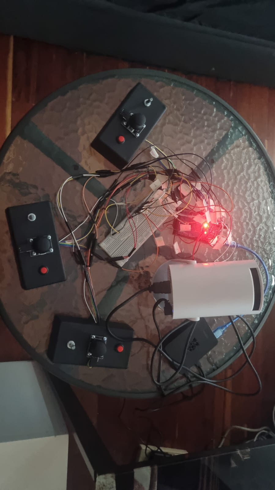

## 📖 Descripción del Proyecto

**Fuerza Fundamental elegida:** Gravedad

**Campos Invisibles** es una experiencia interactiva multiusuario diseñada para un espacio de 5m². Para visualizar la fuerza fundamental de la Gravedad, esta instalación no se limita a mostrar objetos cayendo, sino que divide la gravedad en dos escalas simuladas computacionalmente:

1. **Gravedad Micro (Particle Life):** Un ecosistema de polvo estelar obedece reglas dinámicas y asimétricas de atracción y repulsión, simulando la complejidad matemática de las interacciones a pequeña escala.
2. **Gravedad Macro (Gravitación Universal):** A través de una interfaz analógica, de 1 a 3 visitantes introducen "masas súper-densas" en el lienzo. Al alterar estas masas, los usuarios deforman instantáneamente el tejido del polvo estelar.

La instalación traduce la manipulación de variables físicas reales (masa, vector de posición, fuerza centrífuga) en una simulación visual y sonora proyectada en tiempo real.

### 🎯 Dinámica de Interacción (UX)

* **El usuario:** Tiene un control compuesto por joystick, encoder y pulsador. Utiliza joystick como los de ps2 para desplazarse por el espacio **coordenadas (x, y)**, encoders que funcional como perillas para **aumentar o disminuir** la masa gravitacional de su "atractor", y pulsometros que funcional como botones de arcade para expulsar particulas de polvo estelar.
* **El sistema:** Las partículas en pantalla reaccionan orgánicamente a las masas introducidas por los usuarios. Si un atractor captura demasiada materia en su órbita debido a su alta densidad, se sobrecarga y expulsa la materia violentamente, simulando el comportamiento de un Quásar o la radiación de un agujero negro.
* **El aprendizaje:** El visitante comprende que la gravedad es un baile de influencias invisibles que da forma a la estructura de nuestro universo. Experimentan de forma intuitiva conceptos complejos como la mecánica orbital, los campos de influencia gravitacional, los límites de densidad de la materia y el colapso astrofísico.

## 🏗️ Arquitectura de Hardware y Software

El sistema está construido bajo una arquitectura modular cliente-servidor orientada a eventos. Esta separación de responsabilidades (Frontend visual vs. Backend de hardware) permite que el proyecto sea altamente escalable y ofrezca dos modos de despliegue según el hardware disponible en sala:

### Modos de Despliegue (Modularidad)
1. **Modo Standalone (Todo-en-uno):** La Raspberry Pi 4 se encarga de leer el microcontrolador y, simultáneamente, renderiza la experiencia en pantalla usando Chromium en modo Kiosk. Ideal para espacios con presupuesto o espacio limitado.
2. **Modo Distribuido (Recomendado para Alto Rendimiento):** La Raspberry Pi opera en modo *headless* (sin interfaz gráfica) dedicando el 100% de su CPU a procesar las señales de Arduino y correr el servidor Node.js. Un PC externo (con GPU dedicada) se conecta a la red local de la Raspberry Pi via ssh para procesar el motor gráfico p5.js, logrando el máximo de fotogramas por segundo (FPS) sin latencia.

### Componentes de la Arquitectura
* **Física y Renderizado (Frontend):** `p5.js` Aunque motores como Unity representan mi entorno de desarrollo habitual descarté su uso para esta arquitectura por tres razones estratégicas orientadas a la viabilidad en sala:
  1. **Desempeño en hardware limitado (Raspberry Pi):** Un motor compilado como Unity introduce un *overhead* (consumo excesivo de recursos base) innecesario para una simulación 2D de este tipo. p5.js permite renderizado directo en un navegador ligero (Chromium en modo Kiosk).
  2. **Naturaleza Web y Conectividad:** Al basarse en la web, p5.js se integra de manera nativa y transparente con `Node.js` y `Socket.io`, reduciendo la latencia de las lecturas del Arduino a prácticamente cero, sin los intermediarios o plugins de red que exigiría un motor de videojuegos.
  3. **Mantenimiento y Prototipado Ágil:** Dado el límite de ejecución de 72 horas para la prueba técnica, p5.js permitió iterar fórmulas matemáticas y arte generativo en tiempo real, ofreciendo un código abierto y altamente mantenible.
* **Backend y Comunicación:** `Node.js` con `Socket.io` para emitir eventos de hardware al canvas visual en tiempo real.
* **Microcontrolador:** `Arduino` encargado de leer las señales analógicas/digitales (joysticks, encoders, botones) y enviarlas por protocolo Serial.

### Flujo de Datos
`Sensores Físicos` ➔ `Arduino` ➔ `Puerto Serial (USB)` ➔ `Servidor Node.js (Raspberry Pi)` ➔ `WebSockets (Red Local)` ➔ `Cliente p5.js (Proyección)`

## 🎛️ Rider Técnico y Lista de Materiales

El hardware está pensado para soportar la interacción de 1 a 3 visitantes en simultáneo. A continuación se detalla el hardware exacto utilizado para el prototipado y su función en la arquitectura, contemplando las dos vías de despliegue (Standalone vs. Distribuido):

| Categoría | Componente | Cant. | Función en el Módulo |
| :--- | :--- | :---: | :--- |
| **Cómputo Base** | Raspberry Pi 4 | 1 | Nodo central. Lee sensores y corre el servidor Node.js (En modo *Standalone* también renderiza el motor gráfico). |
| **Cómputo Ext.** | Computador (PC con GPU) | 1 | *(Opcional - Modo Distribuido)*. Se utiliza para procesar el cliente web a máximos FPS si se requiere proyección de alto rendimiento. |
| **Microcontrolador** | Arduino Mega 2560 | 1 | Seleccionado por su amplia cantidad de pines analógicos/digitales para leer 3 interfaces de usuario completas simultáneamente. |
| **Sensórica** | Módulo Rotatorio Encoder (KY-040) | 3 | Control preciso para aumentar/disminuir la masa de los atractores gravitacionales. |
| **Sensórica** | Módulo Joystick Analógico | 3 | Control vectorial continuo (x, y) para desplazar los atractores en el lienzo. |
| **Sensórica** | Pulsador Rojo Chasis Corto NA (12.5mm) | 3 | Gatillo de acción instantánea para eventos de colapso/explosión gravitacional. |
| **Salida A/V** | Proyector HDMI (Ej. marca Redflag) | 1 | Proyección de la experiencia sobre la superficie física del espacio de 5m². |
| **Salida A/V** | Altavoz Bluetooth/Aux (JBL Flip 5) | 1 | Reproducción de la ambientación y voz en off de la experiencia. |
| **Conectividad** | Cables de video (Micro-HDMI a HDMI / HDMI a HDMI) | 2 | Enrutamiento de señal de video dependiendo de si el render se hace desde la Raspberry Pi o desde el PC. |
| **Ensamblaje** | Protoboard, Cables Jumper (~80x), Tornillería (12x) | Kit | Materiales para el prototipado rápido, ruteo electrónico y fijación mecánica de los módulos. |

## 🗓️ Plan de Ejecución, Presupuesto y Estrategia de Desarrollo

Para la proyeccion de la experiencia en el espacio de 5m² dentro de la sala, se plantea la siguiente estructura de gestión de proyecto:

### 💰 Estimación de Costos

| Categoría | Concepto | Costo Estimado |
| :--- | :--- | :--- |
| **Componentes (Electrónica)** | Raspberry Pi 4, Arduino Mega, Encoders, Joysticks, Botones, Cableado, Fuentes de alimentación. | $ 576,000 COP |
| **Componentes (A/V)** | Proyector, cableado de video, Altavoz JBL Flip 5. | $ 600,000 COP |
| **Licencias de Software** | Node.js, p5.js, Arduino IDE, PM2, OS Linux. | **$ 0** (100% Open Source) |
| **Fabricación Local** | Construcción del mobiliario (quiosco) | $ 720,000  COP |
| **TOTAL ESTIMADO** | | **$ 1,896,000 COP** |

### 🧩 Matriz de Ejecución

Para optimizar el presupuesto y garantizar la calidad técnica, el desarrollo se divide de la siguiente manera:

| Desarrollo Interno (In-House) | Subcontratación (Proveedores Locales) |
| :--- | :--- |
| • Arquitectura de Software y Lógica Física (p5.js). • Desarrollo del Backend (Node.js/Serial). • Diseño de UX y flujos de interacción. • Ensamblaje electrónico y ruteo inicial. • Integración y calibración en sala. | • **Diseño Industrial y Mobiliario:** Diseño de la estructura física que albergará la electrónica para protegerla del alto tráfico. • **Carpintería/Mecanizado:** Corte y pintura del quiosco físico. • **Instalación Eléctrica:** Puntos de red y 110V en sala. |

### ⏱️ Cronograma Estimado (Desarrollo e Integración)

Se propone un ciclo de desarrollo ágil y en paralelo de **2 semanas** hasta la entrega final en sala:

* **Semana 1: Ideación, Prototipado y Desarrollo de Software.** Pruebas de concepto con Arduino y p5.js, selección de componentes y validación de la física gravitacional. Programación orientada a objetos (Attractors, Particles), estabilización del servidor Node.js y optimización de FPS. Envío simultáneo de planos al proveedor de mobiliario.
* **Semana 2: Pruebas, Integración Física y Montaje.** Ejecución de pruebas de *stress* (48 horas continuas comprobando PM2 y auto-arranque) en paralelo con la construccion del mobiliario. Integración de la electrónica en el quiosco, instalación en el espacio de 5m² en la sala "Fuerzas Fundamentales", calibración del proyector y entrega final al equipo de operaciones.

## 🚀 Prototipo

Como parte de esta prueba técnica, se ha desarrollado un prototipo inicial a pequeña escala que demuestra la viabilidad de la comunicación Hardware-Software y la estabilidad del motor físico gravitacional

> **Nota importante:** El **prototipo físico** es la versión principal de la prueba con todo el sistema integrado, mientras que esta **demo web** es una versión creada específicamente para facilitar que los evaluadores puedan ver y probar el funcionamiento del proyecto de forma sencilla sin necesidad de contar con el hardware físico.

* **Prototipo Físico Original (Oficial):** Arquitectura completa diseñada para **3 jugadores simultáneos**, integrada mediante microcontroladores (Arduino) con hardware dedicado (joysticks, encoders rotatorios y botones arcade) para cada atractor del ecosistema.
[!gif_prototipo](./public/images/gif_prototipo.gif)
[!gif_prototipo2](./public/images/Gif_prototipo_2.gif)

* **Demo Web (Alternativa de evaluación):** Versión para **1 jugador** diseñada específicamente para que los evaluadores prueben el funcionamiento del ecosistema sin necesidad de hardware. Despliegue en la nube optimizado para navegador. [Pruébalo en este enlace](https://campos-invisibles.vercel.app/).

**Controles de la Demo Web (Teclado):**
* **Movimiento:** Flechas direccionales (`→` `←` `↑` `↓`) o `W` `A` `S` `D`.
* **Masa:** Mantén presionada `Q` (Disminuir) o `E` (Aumentar) para ajustar la capacidad de absorción del atractor.
* **Explosión:** Barra `Espaciadora` para detonar manualmente la materia acumulada.